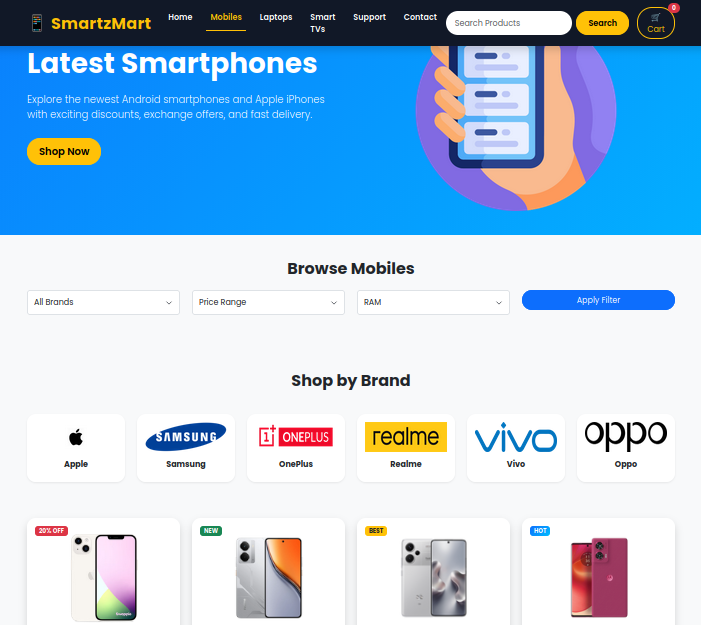
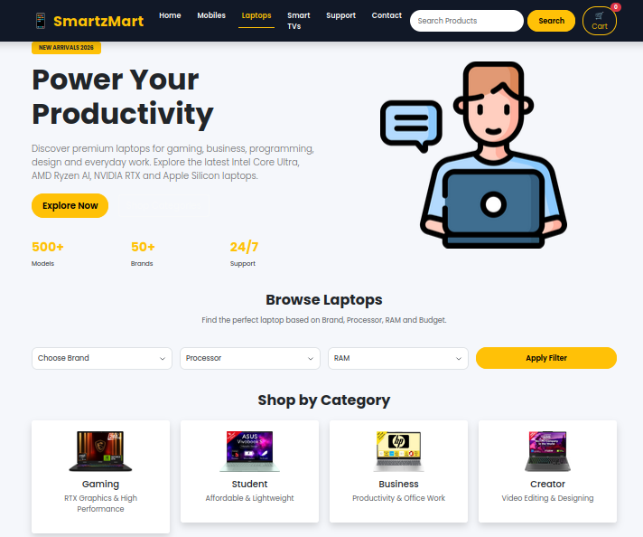
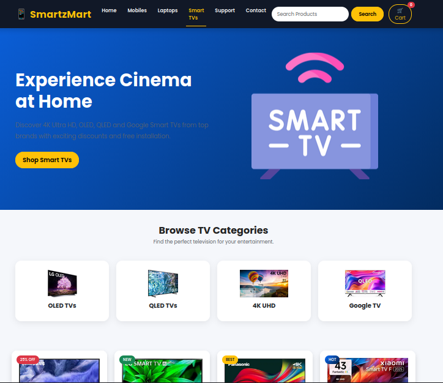
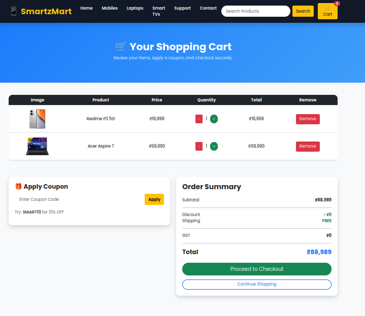

🛒 SmartzMart – Electronics E-Commerce Website

SmartzMart is a modern, responsive electronics e-commerce website developed using HTML5, CSS3, Bootstrap 5, and JavaScript.
It enables users to browse electronics, search for products, manage a shopping cart, apply discount coupons, and navigate through a clean,
responsive interface—all without requiring a backend.

---

📖 About

SmartzMart is a front-end e-commerce project designed to showcase modern web development skills.
The website features dedicated product categories, an interactive shopping cart, live search functionality,
and a responsive user interface that works seamlessly across different devices.

---

✨ Features

- 🎨 Modern and Responsive UI
- 📱 Mobile-Friendly Design
- 🌈 Smooth Hover and Scroll Animations
- 🛒 Add to Cart Functionality
- 🧺 Interactive Shopping Cart
  - Increase/Decrease Quantity
  - Remove Items
  - Automatic Subtotal and Total Calculation
- 🎟️ Coupon Code Support ("SMART10" – 10% Discount)
- 🔍 Live Product Search
- 🔗 "Buy on Flipkart" Product Links
- 📌 Active Navigation Highlight
- 🔝 Back-to-Top Button
- ✨ Scroll Reveal Animations

---

🛠️ Technologies Used

- HTML5
- CSS3
- Bootstrap 5
- JavaScript (ES6)
- Google Fonts (Poppins)

---

📂 Project Structure

SmartzMart/
│
├── index.html
├── mobiles.html
├── laptops.html
├── Tvs.html
├── cart.html
├── Support.html
├── Contact.html
│
├── style.css
├── Mobile-style.css
├── laptop-style.css
├── tvs.css
├── cart.css
├── Support.css
├── contact.css
│
├── script.js
├── products.js
│
├── Images/
│   ├── iphone.avif
│   ├── samsungphone.png
│   ├── hp.webp
│   ├── asus.webp
│   ├── samsung.webp
│   ├── lg.webp
│   └── ...
│
└── README.md

---

📚 Product Categories

- 📱 Mobiles
- 💻 Laptops
- 📺 Smart TVs

---

🛒 Shopping Cart Features

The shopping cart includes:

- Add products from any category
- Update product quantities
- Remove products from the cart
- Automatic subtotal and total calculation
- Apply discount using the coupon code SMART10 (10% Off)

---

📱 Responsive Design

SmartzMart is optimized for:

- 💻 Desktop
- 💼 Laptop
- 📱 Mobile
- 📲 Tablet

---

🚀 Getting Started

Clone the Repository

git clone https://github.com/sanket-ghayal/SmartzMart.git

Run the Project

1. Open the project folder.
2. Make sure the Images folder contains all required product images.
3. Open index.html in your preferred web browser.

No additional installation or backend setup is required.

---

📸 Screenshots

- 🏠 Home Page
  
  
- 📱 Mobiles Page
  
  
- 💻 Laptops Page
  
  
- 📺 Smart TVs Page
  
  
- 🛒 Shopping Cart
  
 
- 🛠️ Support Page
  
  
- 📞 Contact Page
  

---

🚀 Future Enhancements

- 🔐 User Authentication
- ❤️ Wishlist / Favorites
- ⭐ Product Reviews & Ratings
- 🌙 Dark Mode
- 📦 Order History
- 💳 Payment Gateway Integration

---

👨‍💻 Developer

Sanket Ghayal

BCA Graduate | MCA Student | Full Stack Web Development Enthusiast

---

⭐ Support

If you found this project helpful, please consider giving it a Star ⭐ on GitHub.

---

📄 License

This project was developed for educational and learning purposes.

You are free to use, modify, and enhance it for personal or academic projects.
